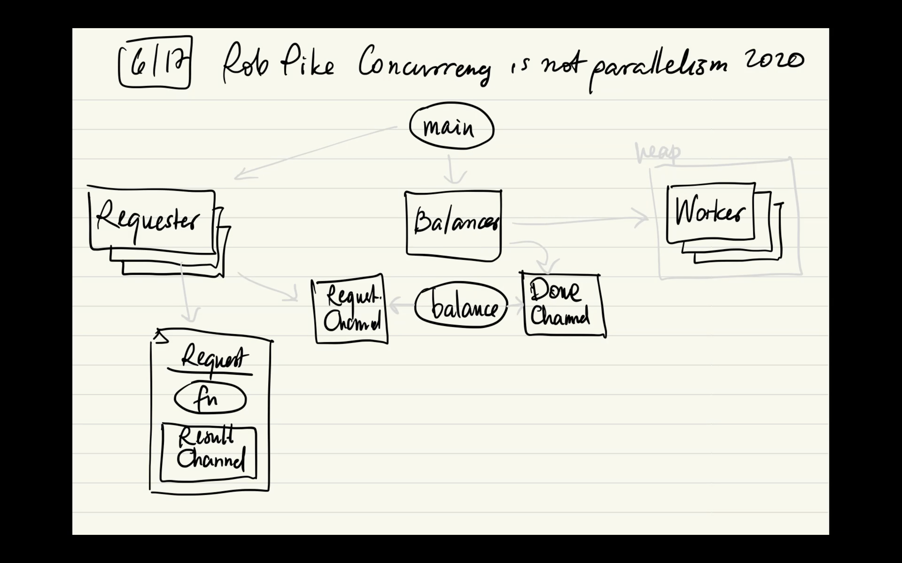

# Load balancer

[Concurrency is not parallelism](https://www.youtube.com/watch?v=qmg1CF3gZQ0)  
[Concurrency is not parallelism Slides](https://go.dev/talks/2012/waza.slide#45)  
[Go Concurrency Patterns Slides](https://go.dev/talks/2012/concurrency.slide#53)

## Design

The requester blocks on requests channel write if the balancer is at capacity (requests back pressure);  
The balancer blocks on requests channel read if no requests;  

The worker blocks on its request channel read if no requests;  
The balancer probes the min load worker on its requests channel write;  
  - on success, continues;  
  - on failure, waits for done;  

The worker won't block at balancer's done channel write since its capacity match available workers;  
